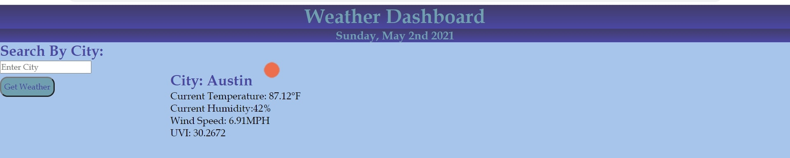

# Rachel's Weather Dashboard

## Table of Contents

- [Description](#description)
- [Instructions](#instructions)
- [Github Profile](#github-profile)
- [Link to Workday Scheduler](#weather-dashboard)
- [Contributors](#contributors)

### Description

This Weather Dashboard will search any city and give you the current and 5 day forecast including temperature, humidity, wind speed and UV index.

### Instructions

1. Type in the city name that you would like to see the forecast for
2. Press "Get Weather"
3. Enjoy your forecast!
4. Press "Clear History" to remove previous searches

### Github Profile

https://github.com/rsolov23/Rachel-s-Weather-Dashboard

### Link to my Workday Scheduler

 https://rsolov23.github.io/Rachel-s-Weather-Dashboard/

### Contributors

- Rachel Solov
- Mad props to Google, Stack Overflow, and MDN Web Docs❤️
- Special shout out to Sean, Donte, Andres, Brendan, Megan, Tori, Mike, Bradley, Ask BCS and all my classmates❤️
