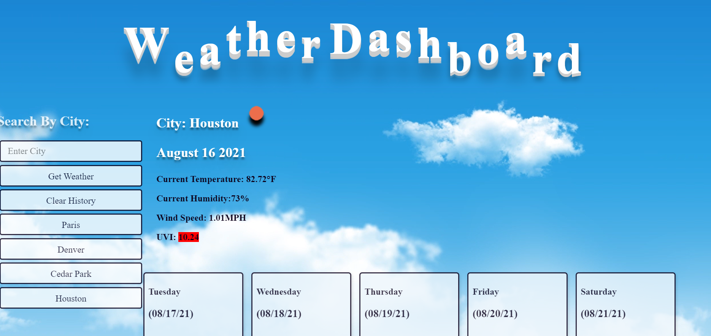

# 🌞Rachel's Weather Dashboard

## **Table of Contents**

- [Description](#description)
- [Instructions](#instructions)
- [Github Profile](#github-profile)
- [Link to Workday Scheduler](#weather-dashboard)
- [Contributors](#contributors)

### _Description_

🔹 This Weather Dashboard will search any city and give you the current and 5 day forecast including temperature, humidity, wind speed and UV index.

### _Instructions_

1. Type in the city name that you would like to see the forecast for
2. Press "Get Weather"
3. Enjoy your forecast!
4. Press "Clear History" to remove previous searches

### _Github Profile_

🔹 https://github.com/rsolov23/Rachel-s-Weather-Dashboard

### _Link to my Weather Dashboard_

🔹 https://rsolov23.github.io/Rachel-s-Weather-Dashboard/

### _Contribution_

🔹 _Feel free to contribute to this project in any of the following ways:_ 
🔹 [Submit bug and feature requests](https://github.com/rsolov23/Rachel-s-Weather-Dashboard/issues) 
🔹 [Review Source Code Changes](https://github.com/rsolov23/Rachel-s-Weather-Dashboard/pulls) and make pull requests from typos to content

**Copyright (c) 2021 Rachel Solov**
